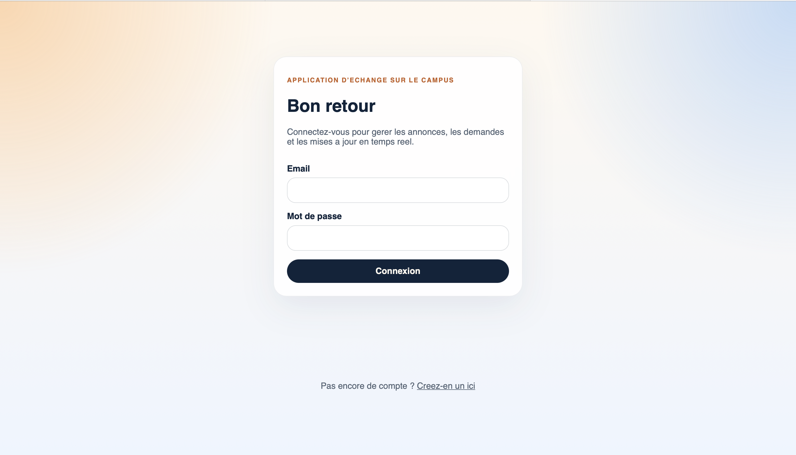

# 🚀 SwapSpot

SwapSpot est une plateforme web full-stack permettant aux étudiants d'échanger des objets scolaires utiles entre eux.

Les utilisateurs peuvent créer un compte, publier des annonces, envoyer des demandes d'échange et recevoir des notifications en temps réel lorsque l'état d'une demande change.

L'objectif de SwapSpot est de simplifier les échanges de matériel scolaire tout en offrant une expérience moderne, rapide et intuitive.

---

# 📸 Aperçu

> Ajoutez ici quelques captures d'écran de l'application.

### Accueil


### Tableau de bord


### Détails d'une annonce


### Demandes d'échange


---

# 🌐 Démonstration

Application :

https://swapspot.onrender.com

API :

https://swapspot-api.onrender.com/api/health

*(Remplacez ces liens par vos véritables URL Render.)*

---

# ✨ Fonctionnalités

## 🔐 Authentification

- Création de compte
- Connexion sécurisée
- Authentification JWT
- Routes protégées
- Mot de passe chiffré avec Bcrypt

---

## 📦 Gestion des annonces

Les utilisateurs peuvent :

- créer une annonce
- modifier leur annonce
- supprimer leur annonce
- consulter toutes les annonces
- consulter une annonce spécifique

Chaque annonce contient notamment :

- titre
- description
- catégorie
- état
- propriétaire
- date de création

---

## 🔄 Gestion des demandes d'échange

Un utilisateur peut :

- envoyer une demande
- modifier une demande
- annuler une demande
- accepter une demande
- refuser une demande
- consulter ses demandes envoyées
- consulter les demandes reçues

---

## ⚡ Temps réel

Grâce à Socket.IO, les utilisateurs reçoivent instantanément les mises à jour importantes.

Événements disponibles :

- listing:created
- listing:updated
- listing:deleted

- request:created
- request:updated
- request:deleted

- notification:new

---

# 🛠️ Technologies utilisées

## Frontend

- React
- Vite
- React Router
- Context API
- Axios
- Socket.IO Client

## Backend

- Node.js
- Express
- MongoDB
- Mongoose
- JWT
- BcryptJS
- Socket.IO

## Déploiement

- Render
- MongoDB Atlas

---

# 📁 Structure du projet

```
SwapSpot
│
├── backend
│   ├── src
│   │   ├── config
│   │   ├── controllers
│   │   ├── middleware
│   │   ├── models
│   │   ├── routes
│   │   ├── sockets
│   │   └── utils
│   └── package.json
│
├── frontend
│   ├── src
│   │   ├── api
│   │   ├── assets
│   │   ├── components
│   │   ├── context
│   │   ├── hooks
│   │   ├── layouts
│   │   ├── pages
│   │   ├── styles
│   │   └── utils
│   └── package.json
│
├── render.yaml
└── README.md
```

---

# ⚙️ Installation

## Cloner le projet

```bash
git clone https://github.com/votre-utilisateur/swapspot.git

cd swapspot
```

---

## Installer les dépendances

```bash
npm install

npm run install:all
```

---

# 🔑 Variables d'environnement

## Backend

Créer

```
backend/.env
```

```env
PORT=5001

MONGODB_URI=your_mongodb_connection

JWT_SECRET=your_secret_key

CLIENT_URL=http://localhost:5173
```

---

## Frontend

Créer

```
frontend/.env
```

```env
VITE_API_URL=http://localhost:5001/api

VITE_SOCKET_URL=http://localhost:5001
```

---

# ▶️ Lancer le projet

```bash
npm run dev
```

Frontend

```
http://localhost:5173
```

Backend

```
http://localhost:5001/api/health
```

---

# 📡 API

## Auth

```
POST /api/auth/signup

POST /api/auth/login

GET /api/auth/me
```

---

## Listings

```
GET /api/listings

GET /api/listings/:id

POST /api/listings

PUT /api/listings/:id

DELETE /api/listings/:id
```

---

## Swap Requests

```
GET /api/requests

GET /api/requests/incoming

GET /api/requests/:id

POST /api/requests

PUT /api/requests/:id

DELETE /api/requests/:id
```

---

# 🔒 Sécurité

L'application inclut plusieurs mesures de sécurité :

- Authentification JWT
- Hachage des mots de passe avec Bcrypt
- Middleware de protection
- Validation des données
- Vérification des permissions
- Variables d'environnement
- Protection des routes privées

---

# 🚀 Déploiement

## Backend

Créer un **Web Service** sur Render.

Configurer :

```
Root Directory

backend
```

Build Command

```
npm install
```

Start Command

```
npm start
```

Variables :

```
MONGODB_URI

JWT_SECRET

CLIENT_URL
```

---

## Frontend

Créer un **Static Site**.

Root Directory

```
frontend
```

Build

```
npm install && npm run build
```

Publish Directory

```
dist
```

Variables

```
VITE_API_URL

VITE_SOCKET_URL
```

Le fichier de configuration Render est disponible ici :

```
render.yaml
```

---

# 🧪 Compte de démonstration

Utilisateur 1

```
Email

demo1@swapspot.app

Mot de passe

Demo123!
```

Utilisateur 2

```
Email

demo2@swapspot.app

Mot de passe

Demo123!
```

*(À adapter selon vos comptes de démonstration.)*

---

# 🔮 Améliorations futures

- Upload d'images
- Favoris
- Recherche avancée
- Pagination
- Messagerie privée
- Historique des échanges
- Évaluations entre utilisateurs
- Géolocalisation
- Notifications par e-mail
- Mode sombre

---

# 👨‍💻 Auteur

**Bara Thiam**

Développeur Web Full-Stack Junior

GitHub

https://github.com/barathiam4388

LinkedIn

https://linkedin.com/in/ajouter-votre-lien

Portfolio

https://ajouter-votre-portfolio.com

---

# 📄 Licence

Ce projet est publié sous la licence MIT.
